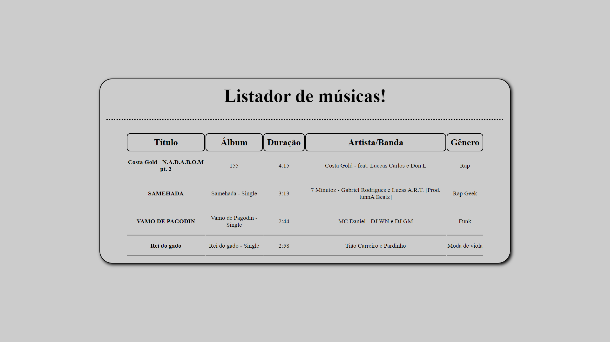
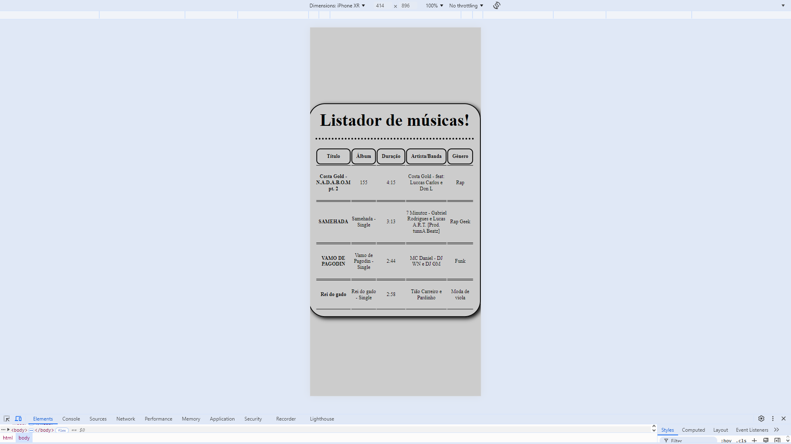

# Desafio Angular - Listador de músicas! 🌟

### Commit: 16/09/2024 - 08:15 (Gerar a tabela de forma dinâmica com base no array de músicas que está em: "MusicTableComponent")

#

> 🎓 Desafio proposto na faculdade Fatec Itu/SP.

> 👨‍🏫 Desafio proposto pelo professor: Glauco Toledo. 

# 

## 🖥️ Como o site está no momento atual no computador:

## 📱 Como o site está no momento atual no celular:


## ✔️ Alterações deste commit:

## Alterações na pasta: ( src / assets)

## Alterações nas pastas de ( src ): ( musics-table )

### app:
- app > musics-table > musics-table.component.html: Removido as músicas inseridas de forma manual na tabela para trocar por uma forma dinâmica (Itens estão em musics-table.component.ts). Fazendo a iteração usando:
``` bash
*ngFor="let music of musics"
```

- app > musics-table > musics-table.component.ts: Adicionado a tipagem dos itens da tabela de músicas e criado o Array para que não precise adicionar de forma manual na tabela.

## Alterações nas pastas de ( assets ):

- assets: Adicionado as duas fotos que foram usadas neste commit para mostrar como o site está no momento atual.

##

### ❤️ Créditos:

#### 🎉 Créditos dos emojis:
> 🔗 <a href="https://emojipedia.org" target="_blank">https://emojipedia.org</a>