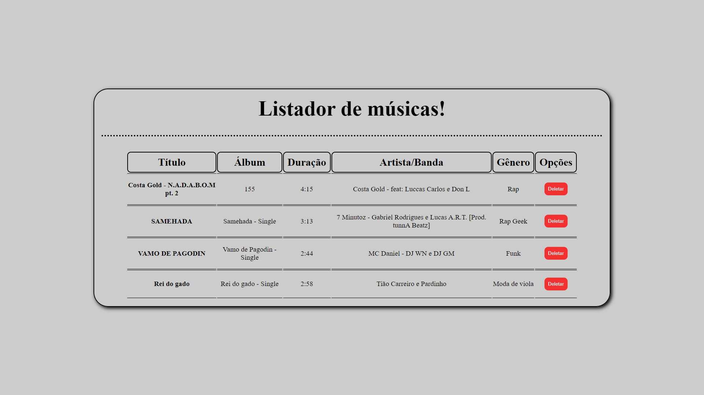
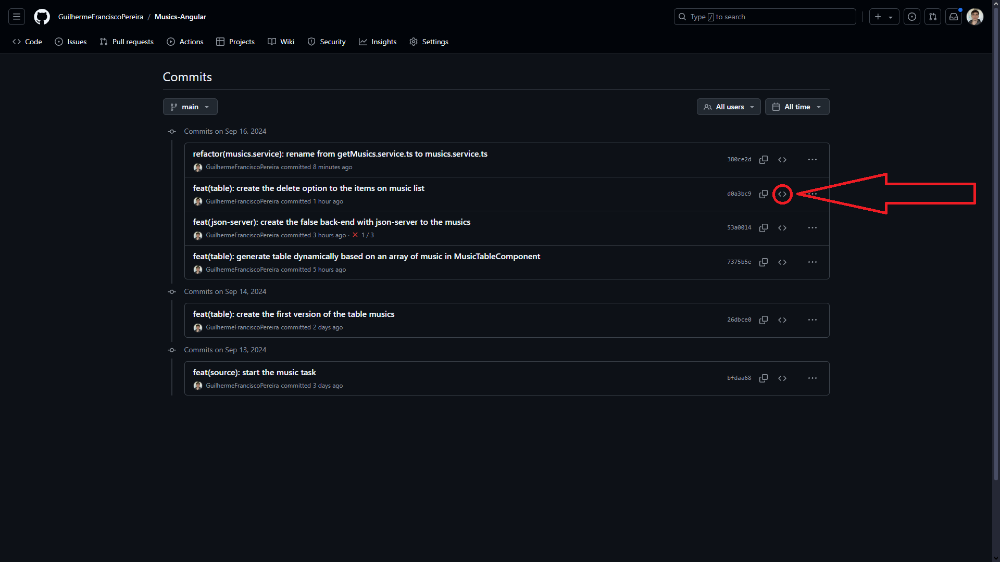
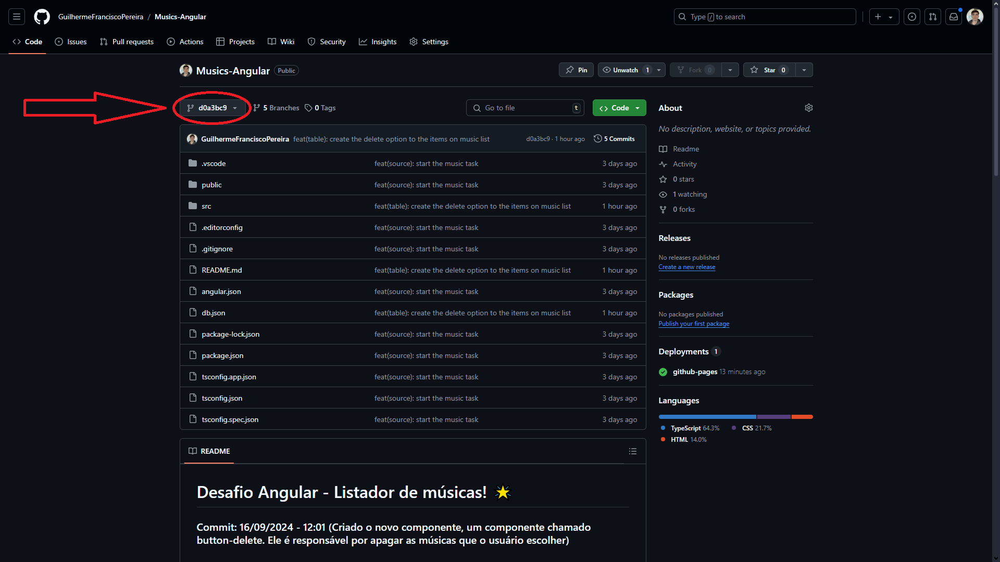

# Desafio Angular - Listador de músicas! 🌟

## 📌 Sobre o desafio:

### O desafio era criar uma tabela em Angular, que listasse diversas músicas e também fosse possível remove-lás.

#

> 🎓 Desafio proposto na faculdade Fatec Itu/SP.

> 👨‍🏫 Desafio proposto pelo professor: Glauco Toledo. 

##

> 🔗 Link do site: <a href="https://guilhermefranciscopereira.github.io/Musics-Angular/" target="_blank">https://guilhermefranciscopereira.github.io/Musics-Angular/</a>

# 

## 🖥️ Primeira versão do site:


##

#

## 🖥 Tecnologias Utilizadas
<div align='center'>


</div>

    - Typescript
    - Angular
        - RxJS
        - Zone.js
    - Json-Server
    - GH-Pages
    - Css

## Versões utilizadas:
    - Typescript: 5.2.2
    - Angular: 18.2.0
        - RxJS: 7.8.0
        - Zone.js: 0.14.10
    - Json-Server: 0.17.4
    - GH-Pages: 6.1.1

## 🙋🏻‍♂ Como me localizar no projeto?

### Todos os arquivos de código fonte do projeto estão em: `./src`

## 🛈 Como o projeto está estruturado

- `./src/app:` Onde possuímos os principais arquivos e módulos que definem a lógica e a estrutura da aplicação.

- `./src/assets:` Aqui está todas as fotos que vão ser usadas no projeto.

- `./src/components:` Temos os componentes que serão reutilizados em diversas partes do código. Nessa primeira versão temos apenas o componente: button-delete.

- `./src/services:` Nesta pasta temos as nossas classes que fornecem funcionalidades reutilizáveis, na primeira versão temos a pasta: (musics.service.ts) onde é feito tanto o "get" quanto o "delete" para o json-server. 

- `./src/types:` Pasta que contem as nossas tipagens que serão utilizadas mais de uma vez. Assim podemos fazer a exportação para diversas partes do código.

## ❔ Como rodar o projeto na minha máquina?

- Antes de tudo, você precisa ter o Git instalado no seu computador. O Git é uma ferramenta que permite clonar e gerenciar repositórios de código.
    - Windows: Baixe o Git <a href="https://git-scm.com/download/win" target="_blank">aqui</a> e siga as instruções de instalação.
    - macOS: Você pode instalar o Git <a href="https://git-scm.com/download/mac" target="_blank">aqui</a> ou usando o Homebrew com o comando brew install git:
        ```bash
        brew install git
        ```
    - Linux: Use o gerenciador de pacotes da sua distribuição, por exemplo para Debian/Ubuntu:
        ```bash
        sudo apt install git
        ```

- Abra o terminal (no Windows, você pode usar o Git Bash, que é instalado junto com o Git).

- Navegue até o diretório onde deseja armazenar o projeto.

- Execute o comando para clonar o repositório:

    ```bash
    git clone https://github.com/GuilhermeFranciscoPereira/Musics-Angular.git
    ```
- Após clonar o repositório, navegue até a pasta do projeto
    ```bash
    cd Musics-Angular
    ```

- Agora você pode abrir os arquivos do projeto com seu editor de texto ou IDE preferido. Exemplo do vsCode: 
    ```bash
    code .
    ```

- 🚨 Não esqueça que para não ocorrer erros no código ao clonar ele, você deve fazer o comando abaixo 🚨
    ```bash
    npm i   
    ```

- Vale ressaltar que já está o link do site no topo desta documentação. Mas caso deseje abrir o servidor pelo terminal você também pode! Dentro do código você pode usar o comando abaixo para abrir o servidor:
    ```bash
    ng s -o
    ```

- Porém, ao abrir o servidor você tem o primeiro acesso ao site, mas sem a ligação com o banco de dados (json-server) e com isso você ainda não tem acesso à opção de deletar uma música usando o botão de deletar. Para fazer a ligação com o banco de dados e conseguir deletar uma música você deve fazer o comando:
    - ⚠️ Já deve ter feito o  ( npm i ) ⚠️
    ```bash
    json-server --watch db.json --port 3000
    ```

- Pronto! Todo o site estará funcionado na sua máquina. Porém, caso precise de alguma ajuda em algo entre em contato comigo pelo meu LinkedIn: https://www.linkedin.com/in/guilherme-francisco-pereira-4a3867283

## ⚠ Informações importantes sobre o projeto ⚠

### Todos os commits do projeto que começam com "feat" possui um readme detalhado do que foi feito naquele commit e também possuem as fotos versão do site naquele momento, então caso deseje ver o processo de criação do código viaje pelos commits e veja as informações!

### Como fazer isso? 

Para você ver o processo de criação e o que foi feito em cada commit siga o passo-a-passo:

- Primeiro: Nessa guia em que você está, suba a tela até encontrar embaixo do botão verde um local igual o da foto abaixo e então clique nele


- Segundo: No lado direito dos commits você encontra clique no simbolo de <> como está na foto e então você irá encontrar como o código estava naquele momento e o readme detalhado daquele momento!


- Terceiro: Depois de encontrar tudo que deseja, caso queira voltar para cá, você irá clicar no local em que a imagem a baixo mostra:


- E então clique em `main` e voltará para cá!

##

## 🎉 É isso! Esse foi o nosso desafio, caso tenha ficado com alguma dúvida ou deseje complementar algo diretamente comigo você pode estar entrando em contato através do meu LinkedIn

> Link do meu LinkedIn: <a href="https://www.linkedin.com/in/guilherme-francisco-pereira-4a3867283" target="_blank">https://www.linkedin.com/in/guilherme-francisco-pereira-4a3867283</a>

### 🚀 Obrigado pela atenção e espero que tenha gostado do que tenha visto aqui, que tal agora dar uma olhada nos meus outros repositórios? 👋🏻

#

### ❤️ Créditos:

#### 🎉 Créditos dos emojis:
> 🔗 <a href="https://emojipedia.org" target="_blank">https://emojipedia.org</a>